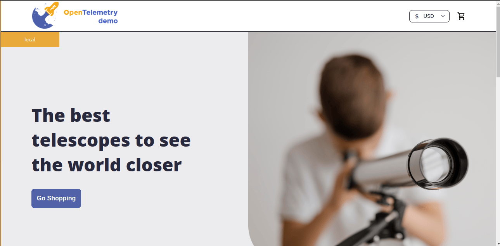
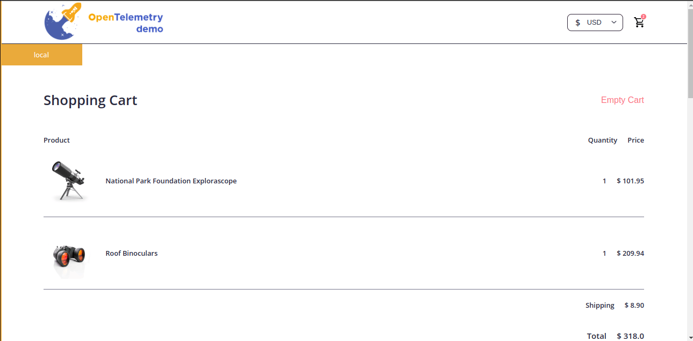
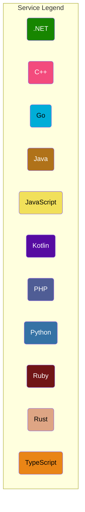

#  OpenTelemetry Demo

**Note:** This project is a fork of `opentelemetry-demo`. Thanks to the team and contributors for opensourcing this wonderful demo project. Definitely one of the best on internet.
## Web store

| Home Page                     | Checkout Screen               |
| ----------------------------- | ----------------------------- |
|  |  |

## 🚀 Application Demo Showcase
[🎥 Watch the Complete Demo](https://res.cloudinary.com/dwgxqgsov/video/upload/v1750324201/0619_auqese.mp4)
---
This repository contains the OpenTelemetry Astronomy Shop, a microservice-based distributed system intended to illustrate the implementation of OpenTelemetry in a near real-world environment.

### 🎯 Project Goals

Our goals are threefold:

- **Real-world Demonstration**: Provide a realistic example of a distributed system that can be used to demonstrate OpenTelemetry instrumentation and observability
- **Extensible Foundation**: Build a base for vendors, tooling authors, and others to extend and demonstrate their OpenTelemetry integrations
- **Living Laboratory**: Create a living example for OpenTelemetry contributors to use for testing new versions of the API, SDK, and other components or enhancements

We've already made [huge progress](https://github.com/open-telemetry/opentelemetry-demo/blob/main/CHANGELOG.md), and development is ongoing. We hope to represent the full feature set of OpenTelemetry across its languages in the future.

## 🏗️ Architecture Overview

OpenTelemetry Demo is composed of **microservices written in different programming languages** that communicate over **gRPC and HTTP**, complemented by a **load generator using Locust** to simulate realistic user traffic.

### System Architecture Diagram

## 🛠️ Services Overview

| Service | Language | Description |
|---------|----------|-------------|
| **[accounting](accounting/)** | .NET | Processes incoming orders and count the sum of all orders (mock/) |
| **[ad](ad/)** | Java | Provides text ads based on given context words |
| **[cart](cart/)** | .NET | Stores the items in the user's shopping cart in Valkey and retrieves it |
| **[checkout](checkout/)** | Go | Retrieves user cart, prepares order and orchestrates the payment, shipping and the email notification |
| **[currency](currency/)** | C++ | Converts one money amount to another currency. Uses real values fetched from European Central Bank. It's the highest QPS service |
| **[email](email/)** | Ruby | Sends users an order confirmation email (mock/) |
| **[fraud-detection](fraud-detection/)** | Kotlin | Analyzes incoming orders and detects fraud attempts (mock/) |
| **[frontend](frontend/)** | TypeScript | Exposes an HTTP server to serve the website. Does not require sign up / login and generates session IDs for all users automatically |
| **[load-generator](load-generator/)** | Python/Locust | Continuously sends requests imitating realistic user shopping flows to the frontend |
| **[payment](payment/)** | JavaScript | Charges the given credit card info (mock/) with the given amount and returns a transaction ID |
| **[product-catalog](product-catalog/)** | Go | Provides the list of products from a JSON file and ability to search products and get individual products |
| **[quote](quote/)** | PHP | Calculates the shipping costs, based on the number of items to be shipped |
| **[recommendation](recommendation/)** | Python | Recommends other products based on what's given in the cart |
| **[shipping](shipping/)** | Rust | Gives shipping cost estimates based on the shopping cart. Ships items to the given address (mock/) |
| **[react-native-app](react-native-app/)** | TypeScript | React Native mobile application that provides a UI on top of the shopping services |

## 🚀 Quick Start

You can be up and running with the demo in a few minutes. Check out the docs for your preferred deployment method:

- **[Docker Deployment](https://opentelemetry.io/docs/demo/docker_deployment/)** - Quick local setup
- **[Kubernetes Deployment](https://opentelemetry.io/docs/demo/kubernetes_deployment/)** - Production-ready orchestration

## 📚 Documentation

For detailed documentation, see [Demo Documentation][docs]. If you're curious about a specific feature, the [docs landing page][docs] can point you in the right direction.

## 🤝 Contributing

If you'd like to help (**which we would love**), check out our [contributing guidance](./CONTRIBUTING.md).

If you'd like to extend this demo or maintain a fork of it, read our [fork guidance](https://opentelemetry.io/docs/demo/forking/).

---

## 🎯 Key Technical Highlights

- **Multi-language Architecture**: Demonstrates OpenTelemetry across 11+ programming languages
- **Real-world Patterns**: Implements common e-commerce microservice patterns
- **Comprehensive Observability**: Full telemetry coverage including traces, metrics, and logs  
- **Production-ready**: Uses industry-standard technologies (Kafka, Valkey, Envoy, etc.)
- **Load Testing**: Built-in realistic traffic simulation with Locust

[docs]: https://opentelemetry.io/docs/demo/
