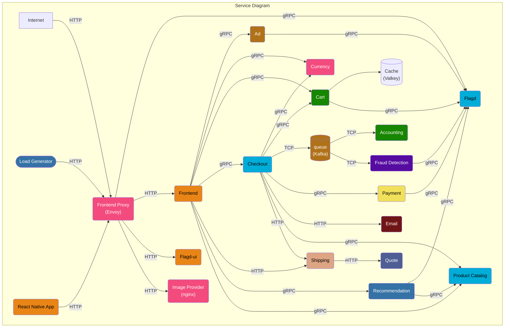
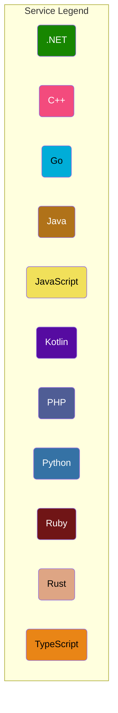

#  OpenTelemetry Demo

**Note:** This project is a fork of `opentelemetry-demo`. Thanks to the team and contributors for opensourcing this wonderful demo project to implement or practice devops.
## Web store

| Home Page                     | Checkout Screen               |
| ----------------------------- | ----------------------------- |
|  |  |

## 🚀 Application Demo Showcase
[🎥 Watch the Complete Demo](https://res.cloudinary.com/dwgxqgsov/video/upload/v1750324201/0619_auqese.mp4)
---
This repository contains the OpenTelemetry Astronomy Shop, a microservice-based distributed system intended to illustrate the implementation of OpenTelemetry in a near real-world environment.

### 🎯 Project Goals

Our goals are threefold:

- **Real-world Demonstration**: Provide a realistic example of a distributed system that can be used to demonstrate OpenTelemetry instrumentation and observability
- **Extensible Foundation**: Build a base for vendors, tooling authors, and others to extend and demonstrate their OpenTelemetry integrations
- **Living Laboratory**: Create a living example for OpenTelemetry contributors to use for testing new versions of the API, SDK, and other components or enhancements

We've already made [huge progress](https://github.com/open-telemetry/opentelemetry-demo/blob/main/CHANGELOG.md), and development is ongoing. We hope to represent the full feature set of OpenTelemetry across its languages in the future.
## 🚀 Quick Start

You can be up and running with the demo in a few minutes. Check out the docs for your preferred deployment method:

- **[Docker Deployment](https://opentelemetry.io/docs/demo/docker_deployment/)** - Quick local setup
- **[Kubernetes Deployment](https://opentelemetry.io/docs/demo/kubernetes_deployment/)** - Production-ready orchestration

## 📚 Documentation

For detailed documentation, see [Demo Documentation][docs]. If you're curious about a specific feature, the [docs landing page][docs] can point you in the right direction.

---

## 🎯 Key Technical Highlights

- **Multi-language Architecture**: Demonstrates OpenTelemetry across 11+ programming languages
- **Real-world Patterns**: Implements common e-commerce microservice patterns
- **Production-ready**: Uses industry-standard technologies (Kafka, Valkey, Envoy, etc.)
- **Load Testing**: Built-in realistic traffic simulation with Locust

[docs]: https://opentelemetry.io/docs/demo/
## 🏗️ Architecture Overview

OpenTelemetry Demo is composed of **microservices written in different programming languages** that communicate over **gRPC and HTTP**, complemented by a **load generator using Locust** to simulate realistic user traffic.

### System Architecture Diagram




## 🛠️ Services Overview

| Service | Language | Description |
|---------|----------|-------------|
| **[accounting](accounting/)** | .NET | Processes incoming orders and count the sum of all orders (mock/) |
| **[ad](ad/)** | Java | Provides text ads based on given context words |
| **[cart](cart/)** | .NET | Stores the items in the user's shopping cart in Valkey and retrieves it |
| **[checkout](checkout/)** | Go | Retrieves user cart, prepares order and orchestrates the payment, shipping and the email notification |
| **[currency](currency/)** | C++ | Converts one money amount to another currency. Uses real values fetched from European Central Bank. It's the highest QPS service |
| **[email](email/)** | Ruby | Sends users an order confirmation email (mock/) |
| **[fraud-detection](fraud-detection/)** | Kotlin | Analyzes incoming orders and detects fraud attempts (mock/) |
| **[frontend](frontend/)** | TypeScript | Exposes an HTTP server to serve the website. Does not require sign up / login and generates session IDs for all users automatically |
| **[load-generator](load-generator/)** | Python/Locust | Continuously sends requests imitating realistic user shopping flows to the frontend |
| **[payment](payment/)** | JavaScript | Charges the given credit card info (mock/) with the given amount and returns a transaction ID |
| **[product-catalog](product-catalog/)** | Go | Provides the list of products from a JSON file and ability to search products and get individual products |
| **[quote](quote/)** | PHP | Calculates the shipping costs, based on the number of items to be shipped |
| **[recommendation](recommendation/)** | Python | Recommends other products based on what's given in the cart |
| **[shipping](shipping/)** | Rust | Gives shipping cost estimates based on the shopping cart. Ships items to the given address (mock/) |
| **[react-native-app](react-native-app/)** | TypeScript | React Native mobile application that provides a UI on top of the shopping services |

## 🐳 Running the Project Locally

This project can be run locally on your personal machine or an EC2 instance using **Docker Compose**. Docker Compose is the preferred method for managing multi-service applications like this e-commerce project, which includes frontend, backend, and database services.

Using Docker Compose, you can easily spin up all the necessary containers with a single command, ensuring proper startup order and network configuration across services. Even if you're new to Docker Compose, you only need to execute a simple command to get the project running initially.

This approach simulates a real development environment and helps you understand the workflow of the project by exploring it hands-on in your browser. It also aligns with industry best practices for running complex applications locally and supports integration within CI/CD pipelines.

### Prerequisites

- Docker and Docker Compose installed on your machine or EC2 instance
- Git to clone the repository

### Quick Start

1. **Clone the repository:**
   ```bash
   git clone <repository-url>
   cd <project-directory>
   ```

2. **Run the project with Docker Compose:**
   ```bash
   docker compose up
   ```

3. **Access the application** through your web browser as per the provided URLs in the project documentation.

This setup will launch all components (frontend, backend, databases) with correct dependencies, giving you a seamless local development experience.

## 🌐 Accessing the Project on the Browser

By default, this project runs on port **8080** and can be accessed via a web browser using the instance's public IP followed by `:8080` (e.g., `http://<your-public-ip>:8080`). Note that it is important to use `http://` explicitly, as the project does not use HTTPS by default.

### ⚠️ Important: Configure AWS Security Groups

AWS EC2 instances come with attached **Security Groups**, which act as virtual firewalls controlling inbound and outbound traffic. By default, these security groups block all inbound traffic except for specific ports like **22 (SSH)** used for secure shell connections.

If you cannot access the project on port 8080, it is likely because this port is not open in your instance's security group inbound rules. To fix this:

1. Navigate to your AWS EC2 dashboard
2. Find the security group associated with your instance
3. Edit the **Inbound Rules** to allow TCP traffic on port **8080** from your preferred sources, such as:
   - Anywhere (`0.0.0.0/0`) if you want public access, or
   - Your specific IP address or IP range for restricted access
   
Once you save these rules, refresh your browser at `http://<your-public-ip>:8080` to access the application.

## 🐳 Containerization of Services

Ichoose to containerize microservices by starting with representative services built in Go, Java, and Python.

### Starting with Go-based Product Catalog Service: 
The containerization workflow involves:

1. **Accessing the environment**: Log in to the provisioned EC2 instance as your containerization workspace
2. **Navigating to the service repository**: Locate the Go service source code within the mono repo under the `/src/productcatalog` directory
3. **Building the service binary**: Before crafting the Dockerfile, it is crucial to build the Go binary to confirm the service compiles and runs as expected outside of a container
4. **Creating a Dockerfile**: Once the binary works correctly, you write the Dockerfile to containerize the service—packaging the executable and defining the container runtime environment

## 🏗️ Docker Setup - Product Catalog

**Multi-stage build** approach using `golang:1.22-alpine`:

* The **first stage** uses the official `golang:1.22-alpine` image as the builder environment. It downloads project dependencies with `go mod download` and compiles the application binary using `go build`
* The **final stage** copies only the compiled binary into a minimal base image, keeping the final container lightweight and secure

The Dockerfile also sets a working directory to organize the build context and leverages Go modules for efficient, reproducible builds. This approach ensures faster image builds, smaller image sizes, and improved security by excluding unnecessary build tools and source files from the runtime image.

### Dockerfile

```dockerfile
FROM golang:1.22-alpine AS builder

WORKDIR /usr/src/app/

# Use Go build cache for dependencies
RUN --mount=type=cache,target=/go/pkg/mod \
    --mount=type=cache,target=/root/.cache/go-build \
    mkdir -p /root/.cache/go-build

# Copy
COPY go.mod go.sum ./

# Download
RUN go mod download

# Copy the rest of the source code
COPY . .

RUN go build -o product-catalog .

####################################

FROM alpine AS release

WORKDIR /usr/src/app/

COPY ./products/ ./products/
COPY --from=builder /usr/src/app/product-catalog/ ./

ENV PRODUCT_CATALOG_PORT 8088
ENTRYPOINT [ "./product-catalog" ]
```

### Java-based Ad Service:

**Prerequisites for Building Locally:**
- Verify Java installation: `java -version`
- If Java is not installed: `sudo apt install openjdk-21-jre-headless`
- Grant permissions to Gradle wrapper: `chmod +x ./gradlew`

**Building the Service:**
1. Navigate to the Ad service directory: `cd /src/ad`
2. The Ad service requires at least JDK 17 and uses Gradle wrapper for compilation
3. Build the service:
   ```bash
   ./gradlew installDist
   # or with proto source directory
   ./gradlew installDist -PprotoSourceDir=./proto
   ```
4. This creates an executable script at `src/ad/build/install/oteldemo/bin/Ad`

**Testing Locally:**
```bash
export AD_PORT=8080
export FEATURE_FLAG_GRPC_SERVICE_ADDR=featureflagservice:50053
./build/install/opentelemetry-demo-ad/bin/Ad
```

## 🏗️ Docker Setup - Ad Service

**Multi-stage build** approach using `eclipse-temurin:21-jdk`:

* The **first stage** uses the official `eclipse-temurin:21-jdk` image as the builder environment. It copies Gradle configuration files, downloads dependencies, and compiles the application using `./gradlew installDist`
* The **final stage** uses the lighter `eclipse-temurin:21-jre` runtime image and copies the built application, keeping the container optimized for production

The Dockerfile leverages Gradle wrapper for dependency management and build automation, ensuring consistent builds across different environments.

### Dockerfile

```dockerfile
FROM eclipse-temurin:21-jdk AS builder

WORKDIR /usr/src/app/

COPY gradlew* settings.gradle* build.gradle .
COPY ./gradle ./gradle

RUN chmod +x ./gradlew
RUN ./gradlew
RUN ./gradlew downloadRepos

COPY . .
COPY ./pb ./proto
RUN chmod +x ./gradlew
RUN ./gradlew installDist -PprotoSourceDir=./proto

#####################################################

FROM eclipse-temurin:21-jre

WORKDIR /usr/src/app/

COPY --from=builder /usr/src/app/ ./

ENV AD_PORT 9099

ENTRYPOINT ["./build/install/opentelemetry-demo-ad/bin/Ad"]
```

**Build and Verify:**
```bash
# Build the Docker image
docker build -t <your-dockerhub-username>/adservice .

# Verify the container runs correctly
docker run -p 9099:9099 <your-dockerhub-username>/adservice
```
